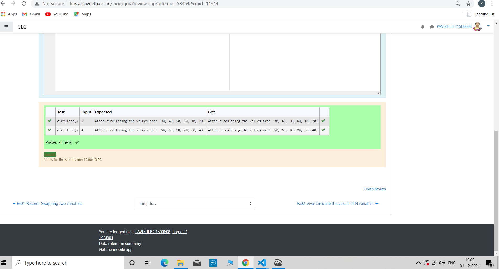

# Circulate-the-values-of-N-variables
## Aim:
To write a python program to circulate the n variables using function concept
## Equipment’s required:
PC
Anaconda - Python 3.7
## Algorithm: 
### Step 1: 
using functions to circulating N values.
### Step 2: 
using built in function def.
### Step 3: 
Get the value from the user for the number of rotation
### Step 4: 
Using the slicing concept rotate the list.
### Step 5: 
print the final value.

## Program:
```
#Program to circulate N values.
#Developed by: B.Pavizhi
#RegisterNumber:21500608
def circulate():
    List1=[10,20,30,40,50,60]
    n=int(input())
    List1=List1[n:]+List1[:n]
    print("After circulating the values are:",List1)
```

## Output:


## Result:
Thus the solution for circulating N has been obtained using python.
